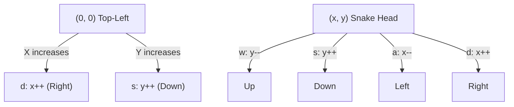
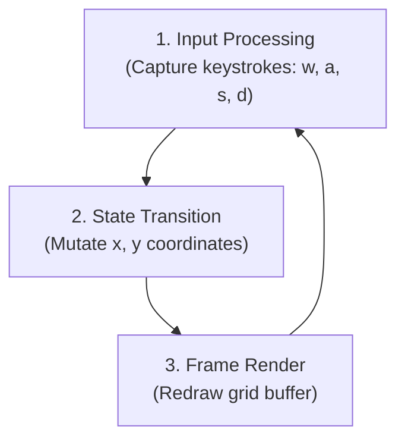
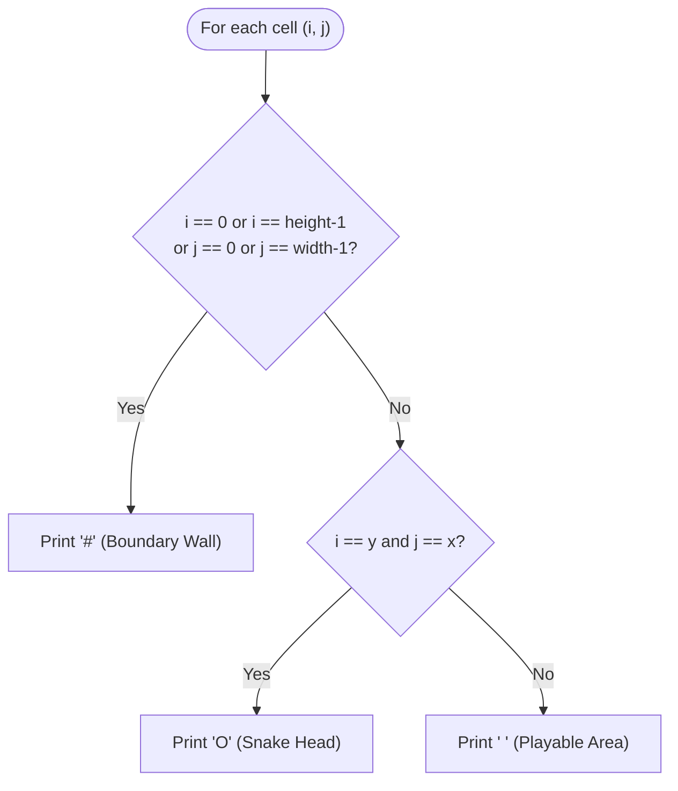

# 🐍 Snake Game in C

A minimalist, terminal-based Snake game built in pure C. This project is a hands-on exploration of core computer science fundamentals — low-level coordinate mathematics, game loop architecture, and disciplined Git version control workflows.


---

## 📐 1. Core Architecture & Mental Model

### The 2D Coordinate Grid

Unlike traditional Cartesian coordinates where `y` increases upwards, terminal screens use **matrix row-column indexing**:

- **Origin `(0, 0)`** is located at the **top-left** corner.
- **X-Axis (Columns):** Runs horizontally, left → right (`0` to `width - 1`).
- **Y-Axis (Rows):** Runs vertically, top → bottom (`0` to `height - 1`).



---

## 🔄 2. Game Loop Lifecycle

Every frame follows a deterministic, three-stage pipeline executed inside a continuous loop:



### State Transition Logic

| Key | Direction | Effect              |
|-----|-----------|----------------------|
| `w` / `W` / `2` | Up        | Decrements row (`y--`) |
| `s` / `S` / `8` | Down      | Increments row (`y++`) |
| `a` / `A` / `4` | Left      | Decrements column (`x--`) |
| `d` / `D` / `6` | Right     | Increments column (`x++`) |
| `q` / `Q` | Exit      | Terminates the game loop |

---

## 🖼️ 3. Frame Rendering Pipeline

Rendering is evaluated **per cell**, using nested iteration over rows (`i`) and columns (`j`):



| Cell Type       | Condition                                              | Rendered As |
|-----------------|----------------------------------------------------------|:-----------:|
| Boundary Wall    | `i == 0 \|\| i == height-1 \|\| j == 0 \|\| j == width-1` | `#`         |
| Snake Head       | `i == y && j == x`                                       | `O`         |
| Playable Area    | *(otherwise)*                                             | ` ` (space) |

---

## 🗺️ 4. Implementation Roadmap

- [x] **Milestone 1:** Construct static boundary box with nested loops.
- [x] **Milestone 2:** Place static snake head token at grid center (`x=10, y=5`).
- [x] **Milestone 3:** Implement turn-based movement loop via coordinate manipulation.
- [x] **Milestone 4:** Introduce food generation and collision detection.
- [ ] **Milestone 5:** Implement real-time non-blocking input and body segment tracking.

```mermaid
gantt
    title Development Roadmap
    dateFormat  X
    axisFormat %s
    section Core
    Static Boundary Box       :done, m1, 0, 1
    Static Snake Head         :done, m2, 1, 1
    section Gameplay
    Turn-Based Movement       :done, m3, 2, 1
    Screen Clear & Buffer     :done, m4_prep, 3, 1
    Food & Collision          :done, m4, 4, 1
    Real-Time Input & Body    :active, m5, 5, 1
```



---

## ⚙️ 5. Build and Run

### Prerequisites

- Clang or GCC

### Compilation

```bash
clang boundary.c -o snake
```

### Execution

```bash
./snake
```

---

## 🤝 Contributing

Contributions, issues, and feature requests are welcome. Feel free to check the [issues page](../../issues) or open a pull request.

## 👤 Author

**Suleman Ahmed Shuvo**
Roll: 43 | Batch: 19
Dept. of Computer Science & Engineering
Sylhet Engineering College

---

## 📝 Changelog

### [0.3.0] - Milestone 4 Complete
- Implemented boundary collision detection to terminate the loop on wall impact.
- Added numeric keypad movement controls (`2`, `8`, `4`, `6`).
- Integrated pseudo-random food spawning (`*`) using `<time.h>` seeded `rand()` and modulo arithmetic.
- Implemented food consumption logic and real-time score tracking counter.

### [0.2.1] - 2026-09-18
- Added `system("clear")` to eliminate terminal scrolling and simulate stationary frame rendering.
- Sanitized input stream using `getchar()` buffer flushing to prevent empty newline double-frames.
- Added full support for uppercase movement keys (`W`, `A`, `S`, `D`).
- Fixed unresponsive quit functionality via `q` / `Q`.

### [0.2.0] - Milestone 3
- Added interactive game loop using `while(1)`.
- Implemented turn-based movement logic via `w`, `a`, `s`, `d` inputs.
- Updated documentation with architectural Mermaid diagrams.

### [0.1.0] - Milestones 1 & 2
- Implemented static terminal grid boundary using nested loops.
- Added centered snake head token (`O` at `x=10, y=5`).
- Initialized Git repository structure and basic documentation.


## 📄 License

This project is licensed under the MIT License — see the [LICENSE](LICENSE) file for details.
